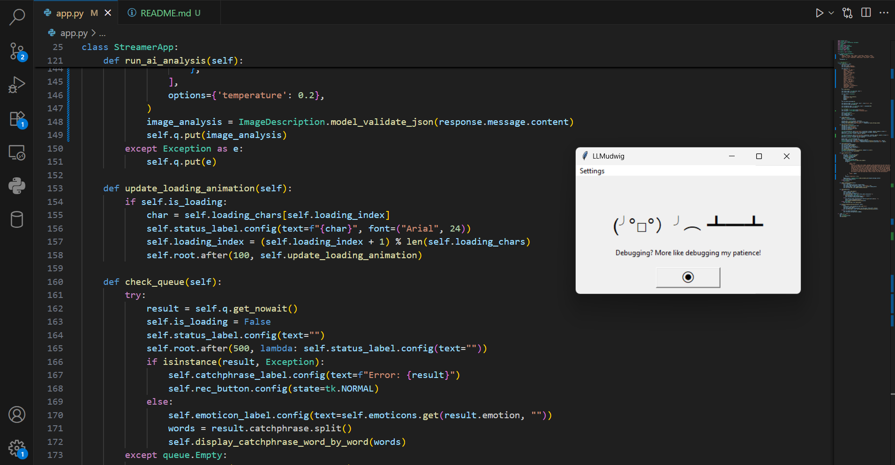

# LLMudiwg
Your AI-powered stream companion for instant, nerdy reactions!

LLMudiwg is a simple desktop application that captures your screen, analyzes the content using a local Large Language Model (LLM), and generates a fun, in-character reaction perfect for streaming. It acts as your AI co-host, providing witty catchphrases and emoticons based on what's happening on your screen.

## Features

- One-Click Analysis: Press the big button to capture your screen and get an instant reaction.
Local First: All analysis is done locally using Ollama, ensuring privacy and speed. No data is sent to the cloud.
- AI Persona: The AI has a built-in personality: an energetic, nerdy streamer who loves code, cats, and all things geeky.
- Customizable: Configure which Ollama model to use and where to save temporary screenshots.
Cross-Platform: Compiled executables are available for Windows and Linux.

### Prerequisites
*This is important! LLMudiwg requires a running Ollama instance with a vision-capable model.*

 Install Ollama: If you haven't already, download and install Ollama from the official website: https://ollama.com/
 Pull a Vision Model: You need a multimodal model that can understand images. We recommend the default model, gemma3:4b, but others like llava will also work. Open your terminal or command prompt and run:
 
        ollama run gemma3:4b

### Installation

 Go to the Releases page of this repository.
 Download the latest executable for your operating system (Windows or Linux).
 No installation is needed. Just run the downloaded file.

### How to Use

 - Launch the LLMudiwg application.
 - Make sure your Ollama application is running in the background with a loaded vision model.
 - Click the big ◉ button.
 - The application will take a screenshot of your entire screen. A loading animation will appear while the AI analyzes the image.
 - After a few moments, an emoticon and a catchphrase will appear in the window, delivered with a fun, word-by-word animation.
 - The button will reappear, ready for your next reaction.

### Settings

You can configure the application by clicking Settings > Configure... in the menu bar.

- Ollama Model: The name of the Ollama model you want to use (e.g., gemma3:4b). This must match a model you have downloaded in Ollama.
- Screenshot Path: The file path where the temporary screenshot will be saved. The default is ./screenshot.png in the same directory as the app.

#### The AI Persona

The AI is prompted to act as a specific character:
A streamer with a happy, energetic, nerdy personality who loves code and cats! Reactions are fun, positive, and sometimes a bit geeky. The AI gets excited about code, cute cats, and anything nerdy.

This ensures the generated catchphrases are consistent and entertaining for a streaming context.

### For Developers

This project is a single Python script using Tkinter for the GUI.

Clone the repository.
 Install the required Python packages:

        pip install ollama pydantic Pillow

    
 Run the application script:
 
        python app.py
    